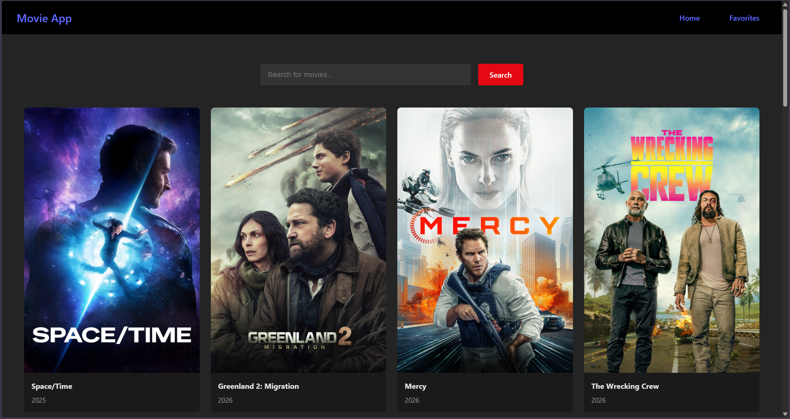
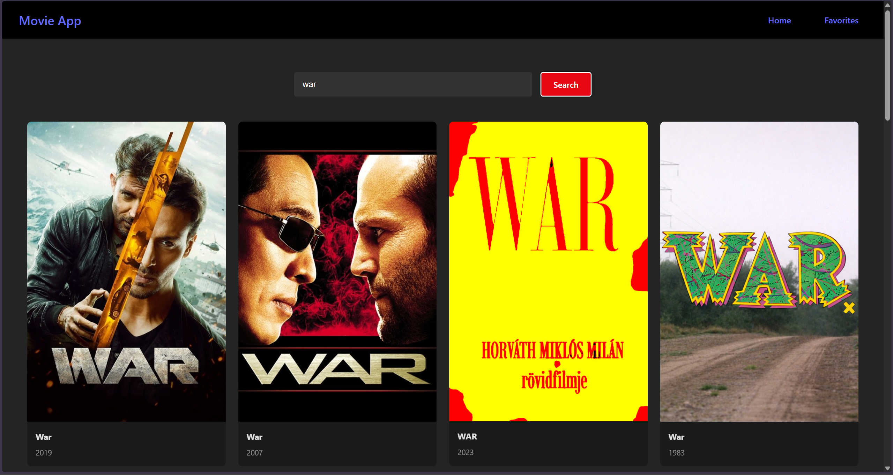
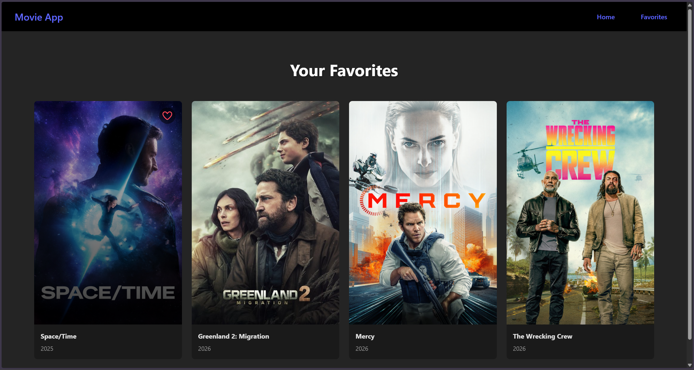

# MovieVault

A modern movie discovery app built with React that lets you browse popular movies, search for titles, and save your favorites. Powered by [The Movie Database (TMDB)](https://www.themoviedb.org/) API.

<div align="center">
  <a href="https://movie-vault-self.vercel.app/">
    
  </a>
</div>

---

## Screenshots

### Home Page


### Search Results


### Favorites Page


---

## Features

- **Browse Popular Movies** — Displays trending movies from TMDB on the home page
- **Search** — Search for any movie by title
- **Favorites** — Add and remove movies from your favorites list
- **Persistent Storage** — Favorites are saved in localStorage and persist across sessions
- **Responsive Design** — Works on desktop and mobile devices

## Tech Stack

- **React 19** — UI library
- **React Router** — Client-side routing
- **Vite** — Build tool and dev server
- **TMDB API** — Movie data source
- **Font Awesome** — Icons
- **Vercel** — Deployment

## Project Structure

```
frontend/
├── src/
│   ├── components/
│   │   ├── MovieCard.jsx
│   │   └── NavBar.jsx
│   ├── contexts/
│   │   └── MovieContext.jsx
│   ├── css/
│   │   ├── App.css
│   │   ├── Favorites.css
│   │   ├── Home.css
│   │   ├── index.css
│   │   ├── MovieCard.css
│   │   └── Navbar.css
│   ├── pages/
│   │   ├── Home.jsx
│   │   └── Favorites.jsx
│   ├── services/
│   │   └── api.js
│   ├── App.jsx
│   └── main.jsx
├── .env
├── package.json
└── vite.config.js
```

## Getting Started

### Prerequisites

- [Node.js](https://nodejs.org/) (v18+)
- A free [TMDB API key](https://www.themoviedb.org/settings/api)

### Installation

1. Clone the repository:
   ```bash
   git clone https://github.com/AtanasG6/MovieVault.git
   cd MovieVault/frontend
   ```

2. Install dependencies:
   ```bash
   npm install
   ```

3. Create a `.env` file in the `frontend/` directory:
   ```
   VITE_TMDB_API_KEY=your_api_key_here
   ```

4. Start the development server:
   ```bash
   npm run dev
   ```

5. Open [http://localhost:5173](http://localhost:5173) in your browser.
